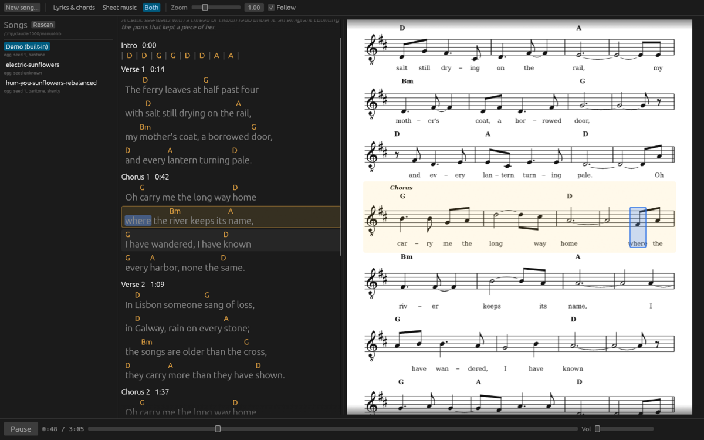

[Home](../)

# User manual

Sunflower Studio plays, displays and writes songs. Claude writes a song as JSON; the engine composes, arranges, synthesizes and mixes it on your machine; the studio shows the lyrics with chords and the sheet music in step with the audio. The `sunflower` command does the same work without a window.

1. [Install and build](install.md): the toolchain, system libraries, the build, and access to Claude.
2. [Getting started](getting-started.md): first launch, the library folder, the built-in demo.
3. [Writing a song](writing.md): the New song form, what Claude writes, where the files go.
4. [Listening and reading](listening.md): the three views, following playback, seeking, zoom, the transport.
5. [Songs and files](songs-and-files.md): the library listing, takes, seeds and determinism, voices, the sidecar files.
6. [The command line](command-line.md): `sunflower demo`, `render`, `write`, `sheet`, `styles`, and the studio's own flags.
7. [Styles](styles.md): the 22 styles with their meters, tempos, bands and forms.
8. [Troubleshooting](troubleshooting.md): banners, errors and their causes.
9. [Credits](credits.md): fonts, measurements and the algorithms' sources.

The manual describes what the code does today. Linux with X11 is the tested platform.
