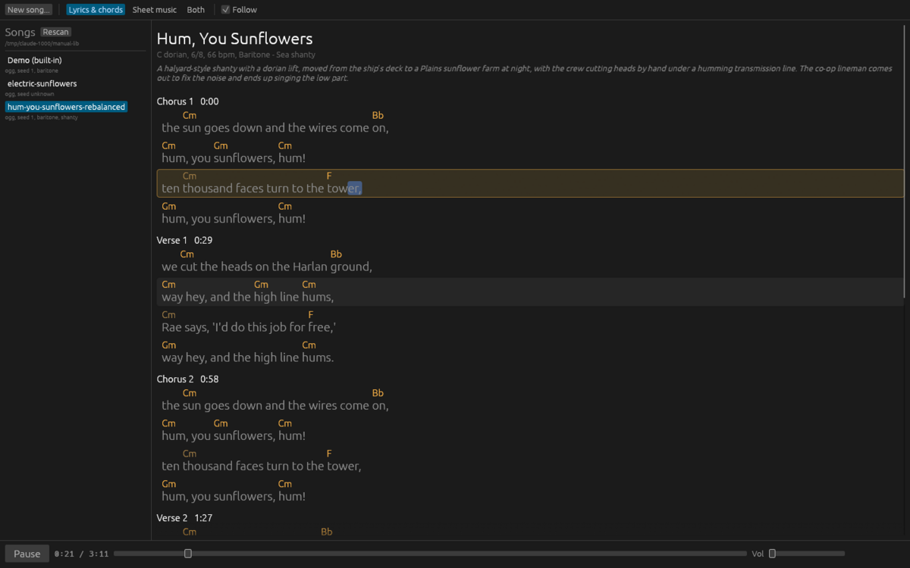
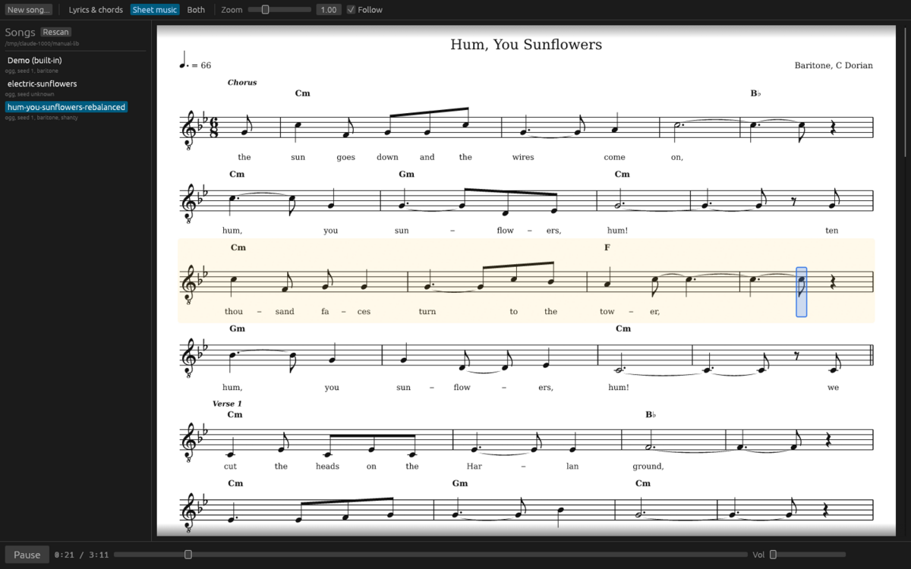

[Manual](./) | Previous: [Writing a song](writing.md) | Next: [Songs and files](songs-and-files.md)

# Listening and reading

The top bar picks the view: **Lyrics & chords**, **Sheet music**, or **Both**. Both views are drawn from the same composition as the audio, so the chords, words and notes on screen are the ones being played, at the times they are played (given the right seed; see [the seed banner](troubleshooting.md#seed-unknown)).

## Lyrics & chords

At the top: the title; a line with the key, mode, meter, tempo, voice and style; the liner note in italics.

Then each section with its start time, for example "Chorus 1   0:00". Sung lines show the words with each chord written above the syllable where it changes. A chord drawn in a dimmer colour at the start of a line is carried over: it was already sounding when the line began. Instrumental sections show one cell per bar, `| D | G | A |`, with `%` for a bar without a new chord.

The key is the sounding key after transposition for the voice, so the chords are the ones the band plays.

During playback the current line is lit and outlined, and the current syllable is marked in blue. In an instrumental section the current bar is marked.

## Sheet music

The sung melody as a lead sheet: title, tempo mark (the beat as a note value), voice and key; one system per lyric line, wrapped when too wide, and one system per run of bars without words; section names over the staff, chord symbols above it and the syllables below. The clef is treble; for bass, baritone and tenor it carries a small 8 below, meaning the voice sounds an octave lower than written. Music glyphs are from the Bravura font.

During playback the current system is shaded and the current note boxed in blue. During a rest a thin blue line moves across the system.

The page is laid out to the width of the view. After you resize the window or the library panel, the page is laid out again once the width has held still for 150 ms. **Zoom** (0.5 to 2.5, shown in the top bar while a sheet is visible) scales the notation. The page is laid out again to fill the view's width, so at a larger zoom more lines wrap onto a second system.

## Both

Lyrics on the left, taking about 38% of the width; the sheet on the right. They follow the same position.

## Following playback

With **Follow** checked (the default), each view scrolls while playing so that the current line or system sits in the middle. Uncheck it to scroll freely. It applies to both views at once and only while sound is playing.

## Seeking

- **Click a lyric syllable** to play from it; click elsewhere on a line to play from the line's start.
- **Click a section heading** (the name and time) to play from the section's start.
- **Click a bar cell** of an instrumental section to play from that bar.
- **Click a note** in the sheet to play from it; click elsewhere on a system to play from the point in the system under the pointer, by proportion.
- **Drag the position slider**, or click on it. While you drag, the clock follows; the jump happens on release.

## The transport

From left to right: **Play** or **Pause**; the clock, position over length; the position slider; **Vol**, the volume (0 to 1). Play and the position slider are disabled until the song has audio.

Above them, when present: a spinner and the current job (loading, rendering, writing) with its elapsed time; errors in red, each with an **x** to dismiss it.

## Keyboard

**Space** plays or pauses, unless a text field has the focus. There are no other shortcuts.

## Notes under the title

A small **N normaliser notes** heading appears above the views when the song needed repairs to be read, or when its style changed something (a tempo clamped to the style's range, for example). Click it to see the list.
