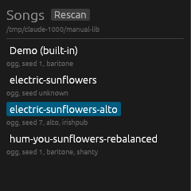
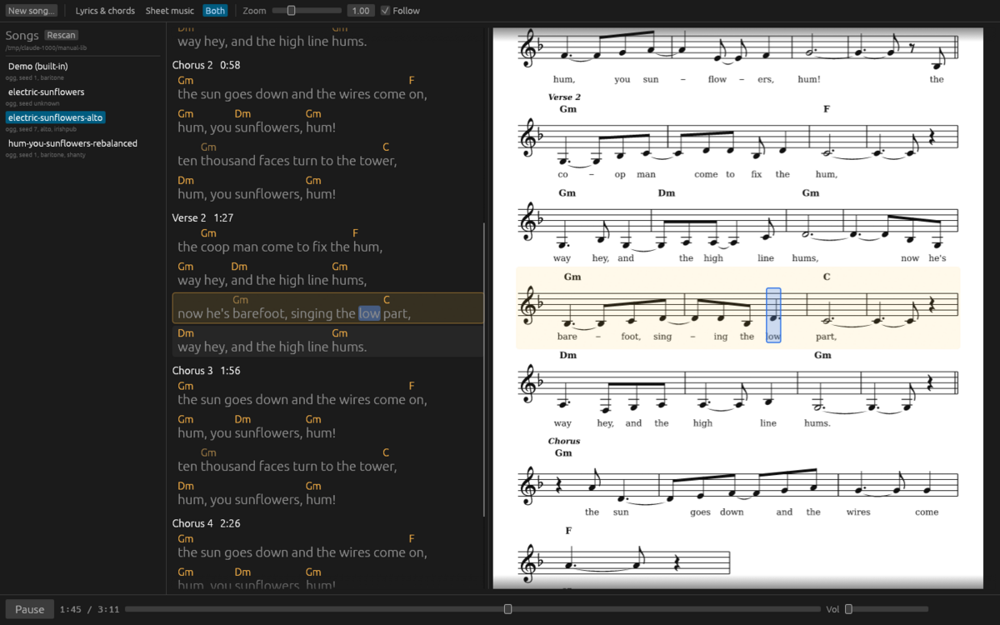

[Manual](./) | Previous: [Listening and reading](listening.md) | Next: [The command line](command-line.md)

# Songs and files

## The library listing

The demo comes first. Then one entry per stem that has a `<stem>.json` song or a `<stem>.render.json` sidecar, sorted by name without regard to case. Under each name a small line gives:

- `ogg` when the audio exists, else `no audio`;
- from the sidecar: `seed N`, the voice, and the style key;
- `seed unknown` when there is audio but no sidecar.

**Rescan** reads the folder again. The list does not watch the folder; press it after adding, removing or renaming files by other means.

Clicking a song loads it: its JSON is read and normalised, the style named in its sidecar is applied, and the melody is composed with the sidecar's seed and voice. If there is no audio, the studio renders it once, automatically.

## The files of a song

| File | Written by | Holds |
|---|---|---|
| `<stem>.json` | Claude (via New song or `sunflower write`), or you | The song as written. The source of everything else. |
| `<stem>.ogg` | the render | The recording, Ogg Vorbis, 44.1 kHz stereo, tagged with title, artist (Claude), liner note, year and style. |
| `<stem>.render.json` | the render | How the recording was made (below). |
| `<stem>.sheet.json` | the render | The song sheet: title, sounding key and transposition, meter, tempo, voice, seed, length, and every section, line, syllable and chord with its time in seconds. For other programs; the studio recomputes it and does not read this file. |

The render sidecar, `<stem>.render.json`:

| Field | Meaning |
|---|---|
| `seed` | The render seed. |
| `voice` | The voice that sang: `bass`, `baritone`, `tenor`, `alto` or `soprano`. |
| `style`, `style_label` | The style key and its name; `null` when no style was applied. |
| `model` | The model that wrote the song, when known. |
| `song_json` | Absolute path of the song JSON. |
| `audio`, `sheet` | Absolute paths of the recording and the song sheet. |
| `created` | When the render finished, UTC, ISO 8601. |

The studio reads `seed`, `voice`, `style`, `song_json` and `audio`. The style key lives only here: the song JSON does not name its style.

## Takes

A take is a recording of another stem's song. It has `<take>.ogg`, `<take>.render.json` and `<take>.sheet.json` but no JSON of its own; its sidecar's `song_json` names the song. The library lists it under its own stem, and opening it loads the named song with the take's seed, voice and style.

Takes are made two ways.

- **In the studio**, only for a song whose seed is unknown: the banner button "Render a new take with seed 1" renders `<stem>-seed1` beside it and opens it.
- **From the command line**, with any seed, voice or style:

      cd ~/Music/sunflower
      sunflower render electric-sunflowers.json --seed 7 --voice alto --style irishpub \
          -o electric-sunflowers-alto.ogg

  then press Rescan. The take above was made this way.

## Re-rendering

The studio renders a song only when it has no audio. To render a song again in place, delete its `<stem>.ogg`, press Rescan and open the song (if it is already open, open another song first): it is rendered with the seed, voice and style in its sidecar. If the studio has already rendered that stem in this session, it shows "No audio." instead; click **Render audio**. Delete the sidecar as well to start from seed 1 with the song's own voice and no style.

After editing a song JSON by hand, click another song and then this one to reload it. The sheet and lyrics then show the edited song, but the old audio does not match it until you render again.

## Seeds and determinism

Claude's writing is the only step that varies. Everything after it is a function of the song JSON, the style, the seed and the voice: the rhythm the words are set to, the melody, the band's parts, the small variations of performance (pitch drift, vibrato, bowing), the instrument bodies and the reverb. The same four inputs give bit-identical audio with any number of threads (`RAYON_NUM_THREADS=1` renders on one thread with the same output).

The lyrics view and the sheet are drawn from the same composition. They match the audio only when they use the seed the audio was rendered with, which is why the sidecar matters. A song opened without a sidecar is drawn with seed 1.

## Voices

Five voices: bass, baritone, tenor, alto, soprano. The song JSON names one; a render may replace it (the Voice field of the New song form, or `--voice` on the command line). The song is transposed, by at most five semitones down or six up, to sit in the chosen voice's range. The lyrics view and the sheet show the transposed key and chords; the sidecar records the voice that sang.

Consonant timing is scaled per voice, and the sheet uses a treble clef, an octave down for bass, baritone and tenor.
