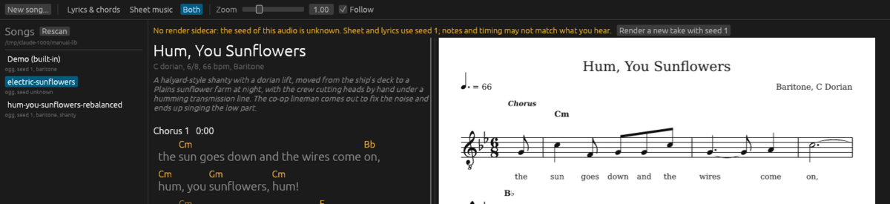

[Manual](./) | Previous: [Styles](styles.md) | Next: [Credits](credits.md)

# Troubleshooting

Errors appear in red above the transport, each with an **x** to dismiss it. The studio also logs what it does to standard error (`studio: opening ...`, `studio: rendered ... in 4.9 s`); start it from a terminal to see the log.

## Seed unknown

> No render sidecar: the seed of this audio is unknown. Sheet and lyrics use seed 1; notes and timing may not match what you hear.

The song has a `<stem>.ogg` but no `<stem>.render.json`, or a sidecar without a seed. The audio was made by other means, or the sidecar was deleted. The studio cannot know which seed made the recording, so it draws the views with seed 1, and they may disagree with the sound. The library marks a song with audio and no sidecar `seed unknown`.

Fixes:

- **Render a new take with seed 1** (the button in the banner) renders `<stem>-seed1` beside the song and opens it. Its views match its audio.
- If you know the seed, voice and style, render a take with `sunflower render` and those values ([Songs and files](songs-and-files.md#takes)), or write the sidecar by hand with at least `"seed"`.

Without a sidecar the song also plays without the style it was written for: the style key lives only in the sidecar.

## N normaliser notes

Not an error. The song needed repairs to be read (a defaulted field, a chord it could not parse, a syllable whose pronunciation it guessed), or its style changed something, such as a tempo clamped into range. Click the heading to read the list. `render sidecar ignored: ...` there means the sidecar exists but is not valid JSON; the song opens as if it had none.

## No sound

"could not open the audio output: ..." under the transport means the default output device could not be opened. Play and the position slider stay disabled; the views and rendering still work. The studio plays through ALSA's default device. Check that `aplay -l` lists a card and that the ALSA default reaches your sound server (on PipeWire or PulseAudio systems, the ALSA plugin package). Restart the studio after fixing it: the device is opened once.

"...: cannot decode: ..." means the `.ogg` file is damaged or not Ogg Vorbis. Delete it, press Rescan and open the song again to render it.

If the clock runs but nothing is heard, check the **Vol** slider; `--volume` sets its starting value.

## Rendering errors

"render failed: ..." means the render could not finish, for example because the folder cannot be written (the message names the path). The studio does not retry by itself. After fixing the cause, click **Render audio** beside "No audio." above the views.

"could not open the song: ..." means the JSON cannot be read: the file is missing, is not JSON, or has no section with a readable lyric line or no readable chord at all. The message names the file.

## Claude errors

Messages begin `new song failed:`.

- `songwriter: claude call failed: could not run the claude CLI: ...`: the `claude` program is not on the `PATH` of the process that started the studio. Install Claude Code, or start the studio from a shell where `claude` runs.
- `songwriter: claude call failed: status N: ...`: the CLI ran and failed; its own message follows. When it says you are not logged in, run `claude` once in a terminal and log in, then try again. The CLI path uses your account, so the same limits apply.
- `API client: configuration: ANTHROPIC_API_KEY is not set`: the API transport was chosen and the variable is not in the studio's environment. Export it before starting the studio; the form warns in amber when it is missing.
- `songwriter: claude call failed: refusal ...`: the model declined the request. Rephrase it.
- `songwriter: claude call failed: reply cut off at the output cap ...`: the reply ran past the output limit (32,000 tokens over the API). Try again.
- `songwriter: no JSON object found in reply: ...`: the reply had no song. Nothing is saved. Try again.
- `the written song failed to normalise (...); saved as PATH`: Claude's JSON was saved but cannot be sung. The message says why. Edit the file and open it, or write again.

Over the API, rate limits (429), server errors (5xx) and transport failures are retried three times, after 1, 2 and 4 s or the server's `retry-after`. The CLI does its own retries.

## A take disappeared

Render sidecars store absolute paths. A take has no JSON of its own, so the library lists it only while the song JSON named by its `song_json` exists. After moving or renaming the library folder, edit `song_json` in each take's `<take>.render.json` to the new path and press Rescan. Songs with their own `<stem>.json` are not affected: the studio looks for `<stem>.ogg` beside the JSON first.

## Other messages

- `no song named "X" in DIR`: `--open` found no entry with that listed name or stem.
- `cannot create the library DIR: ...`: the library folder cannot be created; the list shows only the demo.
- The window does not open: the studio needs a graphical session (`DISPLAY` for X11) and a Vulkan or OpenGL driver. The reason is printed as `studio: ...` on standard error.
