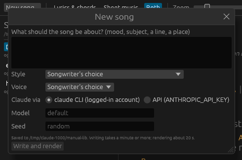

[Manual](./) | Previous: [Getting started](getting-started.md) | Next: [Listening and reading](listening.md)

# Writing a song

Click **New song...** in the top bar. The button is disabled while a render or another song is in progress.



## The form

**What should the song be about?** Anything: a mood, a subject, a line, a place. It is quoted into the prompt word for word. The form will not submit while this box is empty.

**Style.** Songwriter's choice, or one of the 22 [styles](styles.md) by name. The style fixes the forms, meters, tempo ranges and modes to draw from, the harmonic idiom, the guitar pattern, the band and drums, and the instrument that takes the breaks. Songwriter's choice picks one at random.

**Voice.** Songwriter's choice, or Bass, Baritone, Tenor, Alto, Soprano. A chosen voice is named to Claude and also used for the render. Left to the songwriter, Claude names a voice in the song and the render uses it.

**Claude via.** *claude CLI (logged-in account)*, the default, or *API (ANTHROPIC_API_KEY)*. With the API selected and the variable unset, the form says "ANTHROPIC_API_KEY is not set." in amber. See [Install and build](install.md#access-to-claude).

**Model.** Blank means `claude-opus-5-5`. Any model id the transport accepts may be typed here.

**Seed.** Blank means a random seed. Otherwise a whole number from 0 to 18446744073709551615; anything else is refused with "seed ... is not a whole number".

**Write and render** closes the form and starts the work.

## What the seed decides

The seed drives two things.

1. The creative direction given to Claude, drawn in a fixed order: the style (when Songwriter's choice), then within the style the meter, the form and the mode, a world-folk flavour (12% of songs are seasoned with fado, coladeira, son jarocho, conjunto, chanson, klezmer or desert blues), and the emotional register for a prompt that leaves the feeling open. The same seed and style always give the same direction. Claude's reply to it varies from call to call.
2. The render: every random choice the engine makes after Claude, from the melody to the reverb. The same song, seed and voice always give the same recording. See [Songs and files](songs-and-files.md#seeds-and-determinism).

## What Claude writes

The prompt casts Claude as a robot songwriter: born in Menlo Park in 1999 (the year deep learning first went to market, so its age follows the calendar), at home in the American West, with Americana and its roots as heritage and world folk only as seasoning. It gives the style's idiom, the mode, meter and tempo range, and the form as a numbered plan of sections and line counts. It asks for a register that matches your request, and it bars worn subjects (an absent parent, a lost lover, graves, an empty chair, an unsent letter, a homecoming ending and a few more) unless your text raises them.

Claude answers with one JSON object, checked against a schema: title, liner note, key, mode, meter, tempo, voice, band, guitar pattern, and the sections. Each sung line carries the lyric with stressed syllables starred and syllables hyphenated, the ARPAbet pronunciation of each syllable, and one chord entry per bar. An excerpt from a real song:

```json
{
  "title": "Hum, You Sunflowers",
  "key": "D", "mode": "dorian", "meter": "6/8", "tempo": 66, "voice": "baritone",
  "sections": [
    {
      "type": "chorus",
      "lines": [
        {
          "syl": "the *sun goes *down and the *wires come *on,",
          "ph": "dh ax|s ah n|g ow z|d aw n|ae n d|dh ax|w ay r z|k ah m|aa n",
          "chords": ["Dm", "Dm C"]
        }
      ]
    },
    { "type": "chorus", "same": true }
  ]
}
```

Claude makes every writing decision. From here on the engine works alone and makes no further model calls.

## What happens next

1. **Claude writes.** The status line reads "Claude is writing the song" with the elapsed seconds and no progress bar, since the length of a model call is unknown. The form estimates a minute or more.
2. **The reply is saved** as `<slug>.json` in the library, before any check, so that a song the engine rejects is kept. The slug is the title in lower-case ASCII letters and digits, other runs of characters as one hyphen, at most 60 characters; `-2`, `-3` and so on are added when the name is taken.
3. **The song is normalised.** Loose JSON is read leniently; each repair (a defaulted field, a dropped chord, a syllable whose pronunciation had to be guessed) is listed under the song when it opens.
4. **The style is imposed**: its guitar pattern, break instrument, band parts and drum kit. The tempo is clamped to the style's range for the song's meter, widened by 10% each way.
5. **The song is rendered** to `<slug>.ogg` (Ogg Vorbis, quality 0.6) with the progress bar, then `<slug>.render.json` and `<slug>.sheet.json` are written beside it. The form estimates about 20 s for this step; a 3-minute song renders in about 5 s on 12 cores.
6. **The library is rescanned** and the new song opens.

The style key is recorded in `<slug>.render.json`, not in the song JSON. Keep the two together: without the sidecar the song opens with its own band and tempo instead of the style's.

When a step fails, the transport shows the reason in red; see [Troubleshooting](troubleshooting.md). Writing from a terminal works the same way: [`sunflower write`](command-line.md#sunflower-write).
